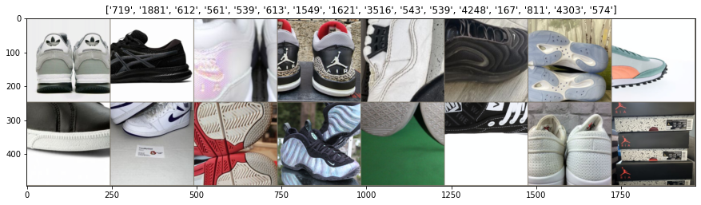

# CleanCodeCup 2023
## Задача
Определения бренда и модели обуви по произвольному фото пользователя. 
Метрика оценки качества MCC.
## Данные
Всего в задаче было 4396 классов. 
Пример данных:

## Решение
Для решения данной задачи я использовал библиотеку pytorch и предобученную модель efficientnet

## Результат
MCC - 0.45.